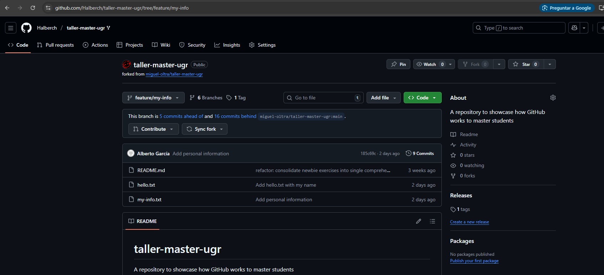

# Exercise Outcomes Submission

**Student/Group Name**: Alberto García Cruz -  Grupo 8
**Level Completed**: newbie
**Date**: 12/01/2026

---

## 📋 Exercise Summary

### Exercise: Fundamentals of Git: Commands, Branches & Remote Operations
**Status**: ✅ Completed

**What I did**:
I configured my global Git identity. Since I did not have write permissions for the professor's original repository, I first forked the project to my own GitHub account and then cloned my fork. I created hello.txt in order to create a first commit. Later, I created a feature/my-info branch to add personal data and synchronized my work with my remote fork using push and pull commands.

**Commands Used**:
```bash
# Setup and Identity
git config --global user.name "Alberto García"
git config --global user.email "albertogc2211@correo.ugr.es"
git clone git@github.com:Halberch/taller-master-ugr.git

# Basic Workflow
git status
git add hello.txt
git commit -m "Add hello.txt with my name"
git log

# Branching and Remotes
git branch feature/my-info
git checkout feature/my-info
git add my-info.txt
git commit -m "Add personal information"
git push origin feature/my-info
git checkout newbie
git pull origin newbie

# Submission Preparation
git checkout -b group-8-outcomes/newbie
```

**Results/Output**:
```
$ git log --oneline -5
037c010 (HEAD -> group-8-outcomes/newbie, newbie) Add hello.txt with my name
360f4a4 (origin/newbie) refactor: consolidate newbie exercises into single comprehensive exercise
5eedc97 docs: Add submission instructions to newbie level
45e1c31 Update README for newbie level exercises
dc58203 Revert "Update README.md"

$ git status
On branch group-8-outcomes/newbie
Untracked files:
  (use "git add <file>..." to include in what will be committed)
        OUTCOMES.md
        OUTCOME_TEMPLATE.md

nothing added to commit but untracked files present (use "git add" to track)

$ git branch -a
  feature/my-info
* group-8-outcomes/newbie
  main
  newbie
  remotes/origin/HEAD -> origin/main
  remotes/origin/feature/my-info
  remotes/origin/intermediate
  remotes/origin/main
  remotes/origin/master
  remotes/origin/master-of-the-universe
  remotes/origin/newbie

$ git log --oneline --graph --all
* 185c69c (origin/feature/my-info, feature/my-info) Add personal information
* 037c010 (HEAD -> group-8-outcomes/newbie, newbie) Add hello.txt with my name

**Screenshots**:
- **GitHub Branches**:
  
```


## 🎯 Key Learnings

**Main concepts I learned**:
1. Forking vs. Cloning: I learned that forking creates a personal copy of a project on the server side, which is necessary when you don't have contributor permissions.
2. Feature Branching: How to keep experimental or personal changes separate from the main development line.
3. Identity Configuration: The importance of setting up user.name and user.email so commits are correctly attributed.

**Skills I improved**:
- Managing remotes and understanding that origin points to my fork.
- Switching between branches safely.
- Using git status as a compass to navigate through the staging area.

---

## 🚧 Challenges Faced

### Challenge 1: Permission Denied on Push
**Problem**: I originally tried to clone the professor's repository directly, but I couldn't push my branches because I didn't have write access.

**Solution**: I used the Fork button on GitHub to create my own copy, updated my local remote (or re-cloned), and successfully pushed to my personal fork.

**Commands/Approach**:
Create a fork of the repo at GitHub
git clone git@github.com:Halberch/taller-master-ugr.git instead of git clone git@github.com:miguel-oltra/taller-master-ugr.git


## 💭 Personal Reflection

**What surprised me**:
I already know these basic stuff.

**What I found most difficult**:
The repository permisions

**What I found most useful**:
Being able to solve unexpected problems

**How I would apply this in real projects**:
I already use this at my work in order to share the same project and organice our work.

---

## 📊 Self-Assessment

Rate your confidence level for each topic (1-5, where 5 is very confident):

| Topic | Confidence (1-5) | Notes |
|-------|------------------|-------|
| Basic Git commands | [5] |It was easy|
| Branching & merging | [5] | |
| Remote operations | [5] | |
| Conflict resolution | [N/A] |N/A|
| History rewriting | [N/A] |N/A|
| Git hooks | [N/A] |N/A|
| Security practices | [N/A] |N/A|

---

## 🔗 Evidence/Artifacts

**Links to branches/commits**:
- Link to your outcome branch: `https://github.com/Halberch/taller-master-ugr/tree/group-8-outcomes/newbie`
- Key commits demonstrating your work:
037c010ef974552ad2d95073a8834dcb1bd3fb64


**Additional files created** (if any):
- GithubBranch.png: [Screenshot]

---

## ✅ Completion Checklist

Before submitting, ensure you have:
- [X] Completed the exercise for your chosen level (including all parts)
- [X] Documented all commands used with their outputs
- [X] Described challenges and how you resolved them
- [X] Provided a thoughtful reflection on your learning
- [X] Self-assessed your confidence in each topic
- [X] Pushed your outcome branch to the remote repository
- [N/A] Created a Pull Request (if required by your instructor)

---


**Submission Date**: [12/01/2026]  
**Ready for Review**: ✅ Yes
